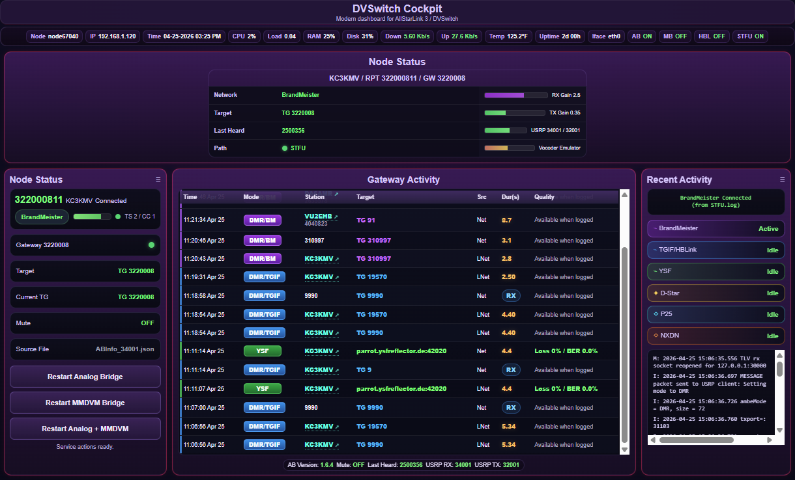

# DVSwitch Cockpit

## Modern Status Dashboard for ASL3 + DVSwitch

✅ Built for ASL3 + DVSwitch on Debian-based systems  
✅ Works with normal DVSwitch installs  
✅ Optional support for BM/STFU and TGIF/HBLink when present  
✅ No network control logic added  

DVSwitch Cockpit is a modern web dashboard for watching what your ASL3 / DVSwitch node is doing.

It gives you one clean place to see:

- current network / mode
- current talkgroup or target
- last heard station
- Gateway Activity
- Local Activity
- DMR ID to callsign lookup
- clickable QRZ callsign links
- YSF quality information when available
- Analog_Bridge and MMDVM_Bridge restart buttons

Simple. Clean. Read-only where it should be.

---

## ✨ What DVSwitch Cockpit can do

DVSwitch Cockpit is meant to be a one-screen status cockpit.

With it, you can:

- see whether your node is on BrandMeister, TGIF, YSF, D-Star, P25, NXDN, or another supported mode
- see the current talkgroup / target
- see recent Gateway Activity
- see recent Local Activity
- see DMR IDs resolved to callsigns when the DVSwitch subscriber database is available
- click resolved callsigns to open QRZ
- see YSF duration, loss, and BER when the backend provides it
- restart Analog_Bridge
- restart MMDVM_Bridge
- restart Analog_Bridge + MMDVM_Bridge together

---  

<p align="center">
    <a href="screenshot.png">
    
  </a>
</p>

<p align="center">
  <em>DVSwitch Cockpit dashboard showing node status, gateway activity, local activity, and DVSwitch runtime information.</em>
</p>

---

## 🚫 What DVSwitch Cockpit does not do

DVSwitch Cockpit does **not** connect or disconnect networks or talkgroups.

It does not add network control logic. It is a status dashboard with limited service restart controls.

If you need mode or talkgroup control, use your normal DVSwitch tools or another controller.

---

## 🚀 Fresh install

Run this on your ASL3 / DVSwitch node:

```bash
cd /var/www/html
git clone https://github.com/TerryClaiborne/dvswitch-cockpit.git dvswitch_cockpit
cd dvswitch_cockpit
sudo ./setup_dvswitch_cockpit.sh
```

Open:

```text
http://YOUR-NODE-IP/dvswitch_cockpit/
```

Example:

```text
http://192.168.1.120/dvswitch_cockpit/
```

---

## 🔄 Update

Run this from the Cockpit directory:

```bash
cd /var/www/html/dvswitch_cockpit
git pull origin main
sudo ./setup_dvswitch_cockpit.sh
```

Always run the setup script after `git pull`.

---

## 🛠️ Fix older installs

Older README instructions may have created this extra folder:

```text
/var/www/html/dvswitch-cockpit
```

The current normal Cockpit folder is:

```text
/var/www/html/dvswitch_cockpit
```

If your install is confusing, or if `git pull` says `not a git repository`, the simplest fix is to remove the old Cockpit folders and reinstall clean.

This removes only DVSwitch Cockpit web files and Cockpit cache files. It does **not** remove DVSwitch, Analog_Bridge, MMDVM_Bridge, AllTune2, or your DVSwitch subscriber database.

```bash
cd /var/www/html

sudo rm -rf /var/www/html/dvswitch-cockpit
sudo rm -rf /var/www/html/dvswitch_cockpit

sudo rm -f /tmp/dvswitch_cockpit_*.json
sudo rm -rf /var/cache/dvswitch-cockpit

git clone https://github.com/TerryClaiborne/dvswitch-cockpit.git dvswitch_cockpit
cd dvswitch_cockpit
sudo ./setup_dvswitch_cockpit.sh
```

Open:

```text
http://YOUR-NODE-IP/dvswitch_cockpit/
```

After that, future updates are:

```bash
cd /var/www/html/dvswitch_cockpit
git pull origin main
sudo ./setup_dvswitch_cockpit.sh
```

---

## 📂 Runtime/cache files

DVSwitch Cockpit stores generated runtime/cache files here:

```text
/var/www/html/dvswitch_cockpit/data/cache/
```

Typical generated files:

```text
dmr_subscribers.json
gateway_history.json
runtime_state.json
subscriber_ids.lastgood.csv
```

These files are generated locally and ignored by Git.

The repo includes this placeholder:

```text
data/cache/.gitkeep
```

That file only makes GitHub show the expected cache directory.

Older Cockpit versions may have created cache files here:

```text
/tmp/dvswitch_cockpit_*.json
/var/cache/dvswitch-cockpit/
```

The setup script migrates old Cockpit cache files into `data/cache/` when found.

Only Cockpit-created cache files are migrated. DVSwitch-owned files are not moved or deleted.

---

## 📡 DMR callsign lookup

Cockpit uses the normal DVSwitch subscriber database when available:

```text
/var/lib/dvswitch/subscriber_ids.csv
```

If that file exists and is valid, Cockpit builds its own local lookup cache in:

```text
/var/www/html/dvswitch_cockpit/data/cache/dmr_subscribers.json
```

If the subscriber database is missing, Cockpit still loads. It will show numeric DMR IDs instead of resolved callsigns.

To update the DVSwitch subscriber database, use the normal DVSwitch update process. On many systems:

```bash
sudo /opt/MMDVM_Bridge/dvswitch.sh update
sudo /opt/MMDVM_Bridge/dvswitch.sh reloadDatabase
```

To clear Cockpit's DMR lookup cache:

```bash
sudo rm -f /var/www/html/dvswitch_cockpit/data/cache/dmr_subscribers.json
```

---

## 🔁 Restart buttons

The restart buttons require a sudoers rule so the web server can restart only the intended services.

The installer creates:

```text
/etc/sudoers.d/dvswitch-cockpit-services
```

Verify it with:

```bash
sudo visudo -cf /etc/sudoers.d/dvswitch-cockpit-services
```

The restart buttons are limited to:

- `analog_bridge.service`
- `mmdvm_bridge.service`

If optional web login is enabled, the dashboard stays visible while logged out, but restart buttons are disabled until you sign in.

---

## 🔐 Optional web login and View Only mode

DVSwitch Cockpit includes optional web login protection for service restart controls.

This is disabled by default so normal local installs continue to work the same way after install or update.

When web login is disabled, Cockpit shows:

```text
No Login / Normal
```

When web login is enabled and you are logged out, Cockpit shows:

```text
View Only / Login
```

In View Only mode:

- the dashboard still loads
- Node Status still loads
- Gateway Activity still loads
- Local Activity still loads
- DMR callsign lookup and QRZ links still work
- restart buttons are disabled
- backend service restart requests are rejected

When you sign in, Cockpit shows:

```text
Signed In / Logout
```

In Signed In mode:

- the dashboard works normally
- restart buttons are enabled
- protected service restart actions are allowed

Clicking Logout returns the dashboard to View Only mode.

---

## 🔑 Set or change the web login password

Run:

```bash
sudo /var/www/html/dvswitch_cockpit/setup_dvswitch_cockpit.sh --set-admin-password
```

The setup script will ask for the password twice.

The password hash is created automatically and saved locally in:

```text
/var/www/html/dvswitch_cockpit/data/private/auth.ini
```

The plain password is **not** stored.

Normal setup/update does not ask for a web password and does not reset your existing web login settings.

---

## 🔓 Disable web login

To turn off web login:

```bash
sudo /var/www/html/dvswitch_cockpit/setup_dvswitch_cockpit.sh --disable-auth
```

This sets Cockpit back to:

```text
No Login / Normal
```

The saved password hash is kept, so you can re-enable login later by running:

```bash
sudo /var/www/html/dvswitch_cockpit/setup_dvswitch_cockpit.sh --set-admin-password
```

---

## 🔒 Web login config file

The real local auth file is:

```text
/var/www/html/dvswitch_cockpit/data/private/auth.ini
```

It contains:

```ini
DVSWITCH_COCKPIT_AUTH_ENABLED=0
DVSWITCH_COCKPIT_ADMIN_USER="admin"
DVSWITCH_COCKPIT_ADMIN_PASSWORD_HASH=""
```

Do **not** upload or commit the real `auth.ini` file.

It is ignored by Git and blocked from browser access by the setup-installed Apache protection.

To safely check the file without showing the password hash:

```bash
sudo grep -nE '^(DVSWITCH_COCKPIT_AUTH_ENABLED|DVSWITCH_COCKPIT_ADMIN_USER|DVSWITCH_COCKPIT_ADMIN_PASSWORD_HASH)=' \
  /var/www/html/dvswitch_cockpit/data/private/auth.ini \
  | sed 's/DVSWITCH_COCKPIT_ADMIN_PASSWORD_HASH=.*/DVSWITCH_COCKPIT_ADMIN_PASSWORD_HASH="[HIDDEN]"/'
```

To confirm it is blocked from browser access:

```bash
curl -k -sS -o /dev/null -w "auth.ini HTTP %{http_code}\n" \
  https://127.0.0.1/dvswitch_cockpit/data/private/auth.ini
```

Expected:

```text
auth.ini HTTP 403
```

---

## 🌐 HTTPS, DDNS, and safe outside access

Web login should be used over HTTPS if you expose Cockpit outside your local network.

Recommended options:

- use Tailscale or another VPN for private outside access
- use a DDNS/domain hostname with a trusted HTTPS certificate
- avoid opening Cockpit directly to the public internet unless you understand the risk

A local IP address such as:

```text
https://192.168.1.120/dvswitch_cockpit/
```

may show a browser certificate warning. That is normal if Apache is using a self-signed certificate or a certificate for a different hostname.

A trusted certificate must match the hostname used in the browser.

For example, a Let's Encrypt certificate for:

```text
kc3kmv.mywire.org
```

will not be trusted for:

```text
192.168.1.120
```

If the browser shows a certificate warning, check what certificate Apache is serving.

Example:

```bash
openssl s_client -connect your-ddns-name.example.org:443 -servername your-ddns-name.example.org </dev/null 2>/dev/null \
  | openssl x509 -noout -subject -issuer -dates -ext subjectAltName
```

Replace `your-ddns-name.example.org` with the real hostname you use in the browser.

If the certificate says `node.local`, `ssl-cert-snakeoil`, or another local/self-signed name, the browser warning is expected.

If the certificate says your router brand name, the router may be answering ports 80/443 instead of forwarding them to the node.

---

## 🧰 Troubleshooting

Check installed version:

```bash
cat /var/www/html/dvswitch_cockpit/VERSION
```

Check Git status:

```bash
cd /var/www/html/dvswitch_cockpit
git status --short
git log --oneline --decorate -5
```

Check the API:

```bash
curl -ksS https://127.0.0.1/dvswitch_cockpit/api/runtime_status.php
```

Check the auth state:

```bash
curl -ksS https://127.0.0.1/dvswitch_cockpit/api/runtime_status.php \
  | python3 -c 'import json,sys; d=json.load(sys.stdin); print("can_restart_services=", d.get("can_restart_services")); print("auth=", d.get("auth"))'
```

If web login is enabled and you are logged out, you should see:

```text
can_restart_services= False
'logged_in': False
```

If you are signed in, you should see:

```text
can_restart_services= True
'logged_in': True
```

Clear Cockpit runtime history:

```bash
sudo rm -f /var/www/html/dvswitch_cockpit/data/cache/gateway_history.json
sudo rm -f /var/www/html/dvswitch_cockpit/data/cache/runtime_state.json
```

Clear DMR callsign cache:

```bash
sudo rm -f /var/www/html/dvswitch_cockpit/data/cache/dmr_subscribers.json
```

Re-run setup:

```bash
cd /var/www/html/dvswitch_cockpit
git pull origin main
sudo ./setup_dvswitch_cockpit.sh
```

---

## 📌 Important paths

```text
/var/www/html/dvswitch_cockpit
/var/www/html/dvswitch_cockpit/data/cache/
/var/www/html/dvswitch_cockpit/data/private/auth.ini
/etc/sudoers.d/dvswitch-cockpit-services
/etc/apache2/conf-available/dvswitch-cockpit-security.conf
```

---

## 📝 Notes

DVSwitch Cockpit observes the existing DVSwitch runtime.

It should not own, overwrite, or replace DVSwitch databases, Analog_Bridge configuration, MMDVM_Bridge configuration, or AllTune2 files.
